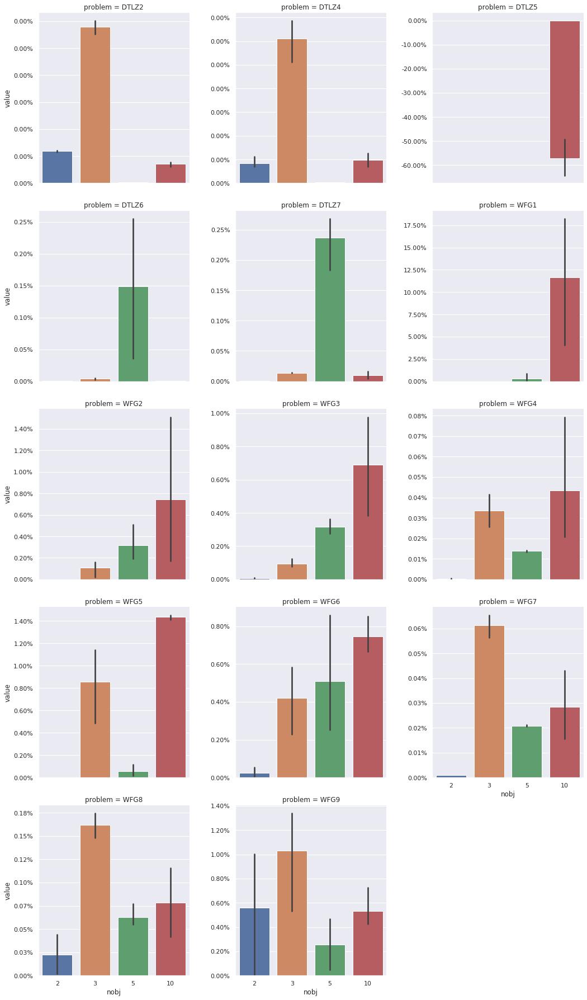

# moea-benchmark

This repository gathers the benchmark data produced in the following paper:

Leonardo C. T. Bezerra, Manuel López-Ibáñez, and Thomas Stützle. A large-scale experimental evaluation of high-performing multi- and many-objective evolutionary algorithms. Evolutionary Computation, MIT Press, 2018.

The indicator outputs can be downloaded directly as a GZip'ed CSV file, without cloning the entire repo.

---

In Section 4.1, we mention three sets of reference fronts, which are provided for reproducibility:
- The original 1,000 randomly-generated Pareto-optimal-point fronts, which needed improving: [fronts.tar.xz](fronts.tar.xz)
- The randomly-generated Pareto-optimal-point fronts, used to tune the MOEAs selected to improve the reference fronts: [improve-fronts.tar.xz](improve-fronts.tar.xz)
- The improved reference fronts, obtained by running the selected MOEAs for 150,000 FEs with the parameter settings obtained in the previous step: [reimprove-fronts.tar.xz](reimprove-fronts.tar.xz)

The hypervolume for original and improved fronts are provided as a GZip'ed CSV file. The relative improvement is illustrated on the barplot below, where the error bar reflects the variability across different numbers of variables.

